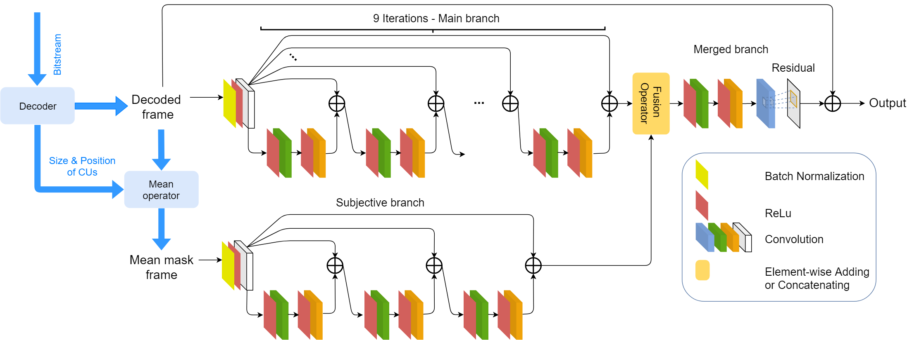

# B-DRRN: A Block Information Constrained Deep Recursive Residual Network for Video Compression Artifacts Reduction (PCS'19)
[Paper](https://doi.org/10.1109/PCS48520.2019.8954521)

Trinh Man Hoang,
[Jinjia Zhou](https://www.zhou-lab.info/jinjia-zhou)

Picture Coding Symposium, Ningbo, China, PCS 2019

### Table of Contents
1. [Introduction](#introduction)
1. [Citation](#citation)
1. [Requirements and Dependencies](#requirements-and-dependencies)
1. [Testing Pre-trained Models](#testing-pre-trained-models)
1. [Training New Models](#training-new-models) 

### Introduction
We developed a B-DRRN with an additional branch that used the Recursive Residual structure for limiting the size of the network.
This branch then is used to learn the features from the block information which is represented for the source of block-based video
coding artifact. Furthermore, our B-DRRN uses the sharing weight technique for all branches to keep the number of parameters remains 
the same with the main branch.

  

  

### Citation
If you find the code and datasets useful in your research, please cite:

    @article{B-DRRN,
         title={B-DRRN: A Block Information Constrained Deep Recursive Residual Network for Video Compression Artifacts Reduction},
         author={Trinh Man Hoang, Jinjia Zhou},
         journal={Picture Coding Symposium},
         doi={10.1109/PCS48520.2019.8954521},
         year={2019}
    }

### Requirements and Dependencies
- Ubuntu 16.04.5 LTS
- Python 3.6.8
- Cuda & Cudnn (We test with Cuda = 10.0 and Cudnn = 7.6.5)
- PyTorch 1.3.0
- Tensorflow (-gpu) 1.14.0
- NVIDIA GPU (We use Teska V100 with compute = 7.0)
- Scikit-image 1.3.0
- Scipy 1.14.0
- Baseline HEVC - HM software 16.20

### Testing Pre-trained Models
Make model weights dir and Middlebury dataset dir:

    $ cd B_DRRN
    $ mkdir model_weights
    $ mkdir test_data
    
Download pretrained models for QP = 37 from https://drive.google.com/open?id=1HT1169L2U8VUJjCAjxTx0BYwaCVsJa8o and put it into ./model_weights/ folder.
    
Download and uncompressed the test set:

Decoded frames: https://drive.google.com/open?id=1PKRHDBPjY685oVBtkATUpzEVPpbh1FOs

    $ unzip decoded_frames.zip

Mean Mask frames: https://drive.google.com/open?id=1Z4hwD5o7myFDNiM5pyHZq9SZ9mMEcfS-
    
    $ unzip mean_mask_frames.zip

Ground Truth: https://drive.google.com/open?id=1etkaj9q38QyeiOQAI_06fW2Mv6a1-voj
    
    $ unzip ground_truth.zip

We are good to go by:

    $ python source/test/test.py --arch 'BDRRN' --weights_path 'path/to/your/weight.pth' --images_dir '/path/to/decoded_frame/folder/' --parts_dir '/path/to/mean_mask/folder/' --outputs_dir 'path/to/your/results_folder/' --gts_dir '/path/to/the/groundtruth/folder/' --num_channels 1 --cuda_device 0

### Training New Models
    
Run the training script:

    $ python source/train/train.py --arch 'BDRRN' --images_dir '/path/to/decoded_frame/folder/' --parts_dir '/path/to/mean_mask/folder/'  --labels_dir '/path/to/the/groundtruth/folder/' --outputs_dir 'path/to/weights/folder/' --num_epoch 150 --num_channels 1 --cuda_device 0 --batch_size 256 --format '.png'

### Contact
[Trinh Man Hoang](mailto:hoangtrinh1001@gmail.com)

### License
This repository (as well as its materials) is for non-commercial uses and research purposes only.
